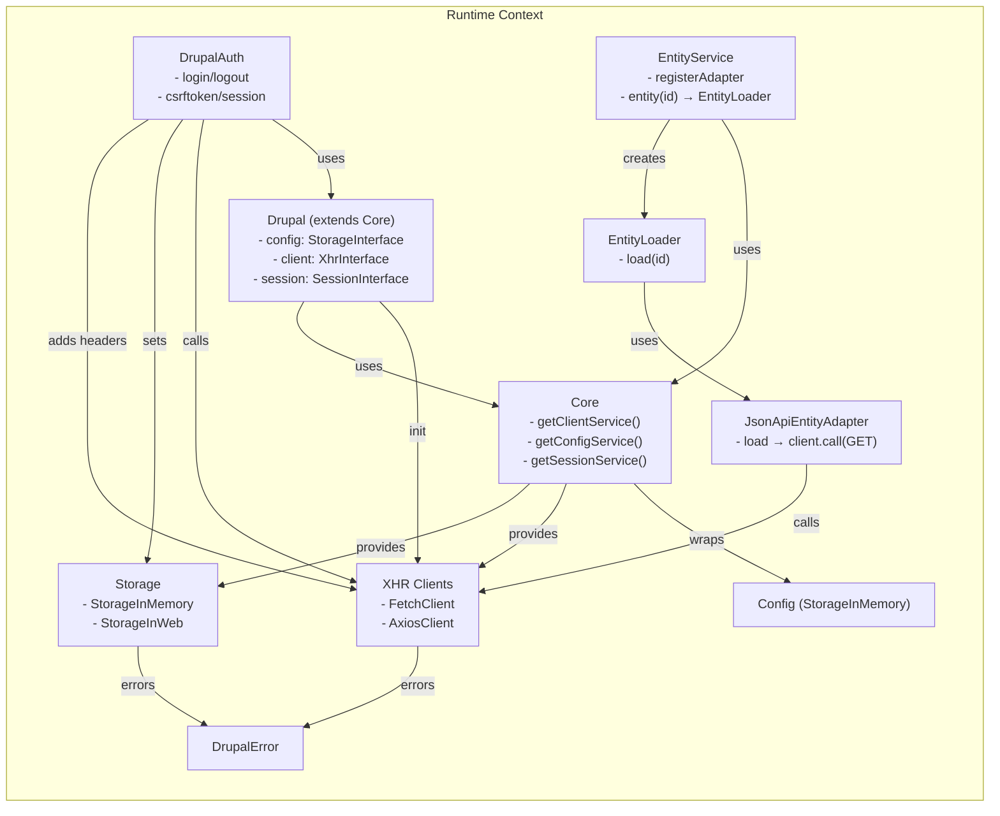
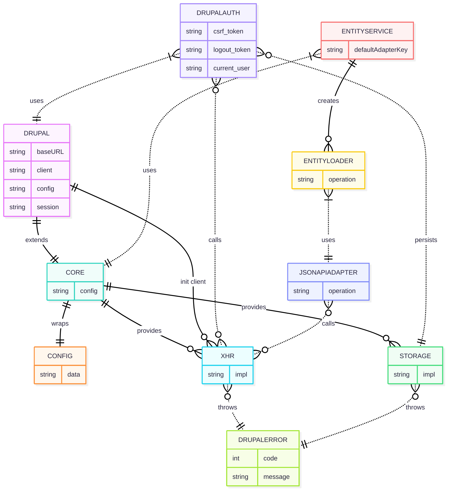

### Runtime Component Architecture

!!! note

    - `Drupal` composes the HTTP client and exposes it via `Core.getClientService()`.
    - `DrupalAuth` persists CSRF/logout tokens in session storage and injects the `X-CSRF-Token` header via `XhrInterface.addDefaultHeaders()`.
    - Entities are accessed through `EntityService` which instantiates an adapter (default: JSON:API).

### ERD (Entity-Relationship) View

