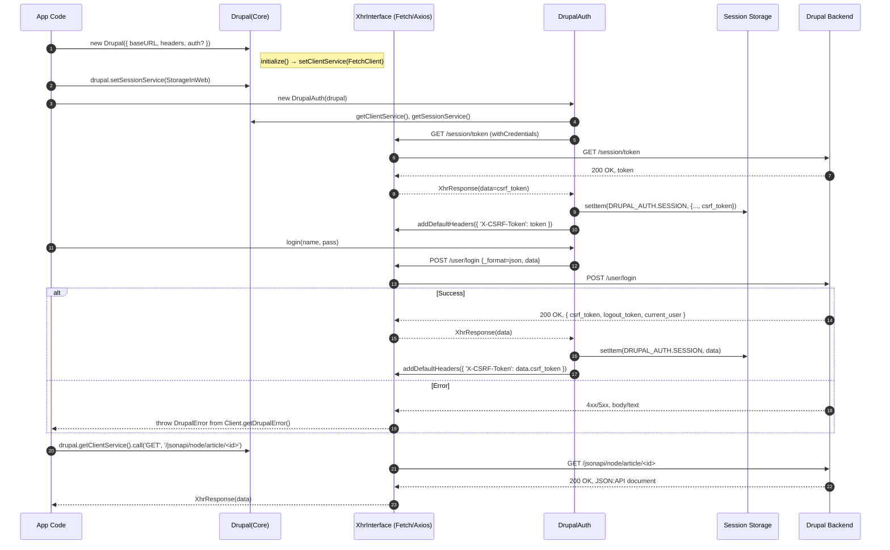

### Login and Session Flow

```mermaid
sequenceDiagram
  autonumber
  participant App as App Code
  participant Drupal as Drupal(Core)
  participant XHR as XhrInterface (Fetch/Axios)
  participant Auth as DrupalAuth
  participant Storage as Session Storage
  participant Server as Drupal Backend

  App->>Drupal: new Drupal({ baseURL, headers, auth? })
  Note right of Drupal: initialize() → setClientService(FetchClient)

  App->>Drupal: drupal.setSessionService(StorageInWeb)

  App->>Auth: new DrupalAuth(drupal)
  Auth->>Drupal: getClientService(), getSessionService()
  Auth->>XHR: GET /session/token (withCredentials)
  XHR->>Server: GET /session/token
  Server-->>XHR: 200 OK, token
  XHR-->>Auth: XhrResponse(data=csrf_token)
  Auth->>Storage: setItem(DRUPAL_AUTH.SESSION, {..., csrf_token})
  Auth->>XHR: addDefaultHeaders({ 'X-CSRF-Token': token })

  App->>Auth: login(name, pass)
  Auth->>XHR: POST /user/login {_format=json, data}
  XHR->>Server: POST /user/login
  alt Success
    Server-->>XHR: 200 OK, { csrf_token, logout_token, current_user }
    XHR-->>Auth: XhrResponse(data)
    Auth->>Storage: setItem(DRUPAL_AUTH.SESSION, data)
    Auth->>XHR: addDefaultHeaders({ 'X-CSRF-Token': data.csrf_token })
  else Error
    Server-->>XHR: 4xx/5xx, body/text
    XHR-->>App: throw DrupalError from Client.getDrupalError()
  end

  App->>Drupal: drupal.getClientService().call('GET', '/jsonapi/node/article/<id>')
  XHR->>Server: GET /jsonapi/node/article/<id>
  Server-->>XHR: 200 OK, JSON:API document
  XHR-->>App: XhrResponse(data)
```

