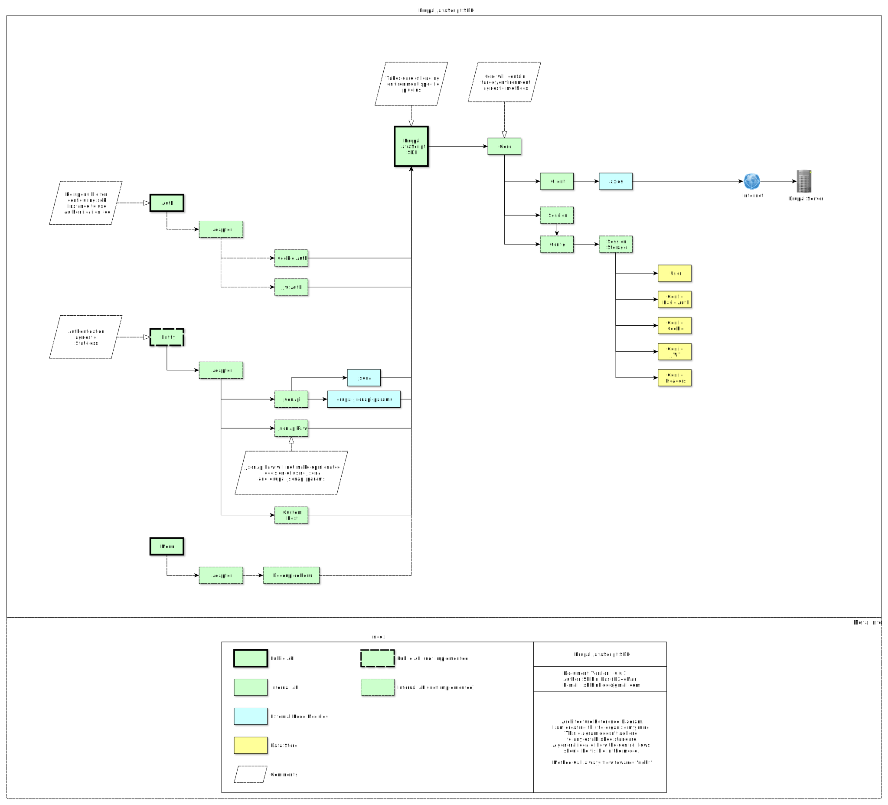

# Introduction

**Drupal JavaScript SDK** helps JavaScript apps connect to a :fontawesome-brands-drupal: Drupal backend.

You can benefit if your app:

- Connects to a decoupled Drupal site
- Authenticates with Drupal
- Uses decoupled menus
- Needs clearer error handling
- Prefers practical guides and examples

### Architecture

- Core: configuration, session, HTTP client plumbing
- Feature packages: `@drupal-js-sdk/auth`, `@drupal-js-sdk/menu`, etc.
- Entity (opt-in): `@drupal-js-sdk/entity` facades + adapters like `@drupal-js-sdk/jsonapi`

<figure  markdown="1">

</figure>

### Contribute

Development is on GitHub. For issues and credits, use the Drupal issue queue[^1].

[^1]: Issue queue on Drupal.org for Drupal JS SDK: [https://www.drupal.org/project/issues/drupal_js_sdk?categories=All](https://www.drupal.org/project/issues/drupal_js_sdk?categories=All)

### Supported Drupal Versions

- Drupal 10
- Drupal 11